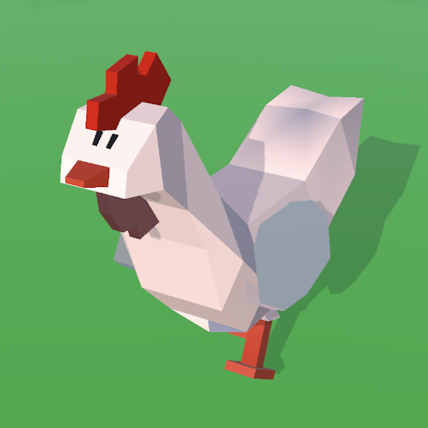

# Frantic Chicken
Unity Project of [__Perihan Yıldız Topal__](https://www.linkedin.com/in/p-yildiz-topal) from my Summer Internship in [__The Game Circle__](https://www.thegamecircle.com/)

## Hyper-casual Runner Game for Android Mobile Phones

__Completion Time:__ 20 days

__Programs Used:__
* Unity
* Blender
* Visual Studio Code

__Models and Animations__ by [__Alper Bozkurt__](https://www.linkedin.com/in/benalperbozkurt/)

Some Animations from [Mixamo.com](https://www.mixamo.com/#/)

Sound Effects from [Freesound.org](https://freesound.org/) and [Pixabay.com](https://pixabay.com/)

__Assets Used:__
* [Hypercasual - Runner Starter Kit](https://assetstore.unity.com/packages/templates/systems/hypercasual-runner-starter-kit-249286)
* [DOTween (HOTween v2)](https://assetstore.unity.com/packages/tools/animation/dotween-hotween-v2-27676)
* [Free Double Sided Shaders](https://assetstore.unity.com/packages/vfx/shaders/free-double-sided-shaders-23087)
* [GUI PRO Kit - Simple Casual](https://assetstore.unity.com/packages/2d/gui/icons/gui-pro-kit-simple-casual-203399)
* [NaughtyAttributes (https://assetstore.unity.com/packages/tools/utilities/naughtyattributes-129996)]
